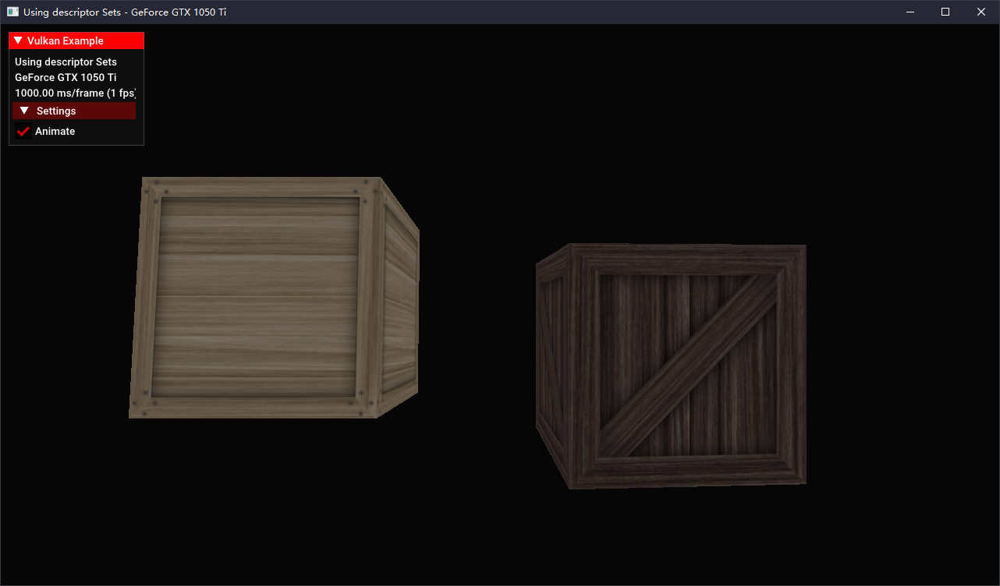
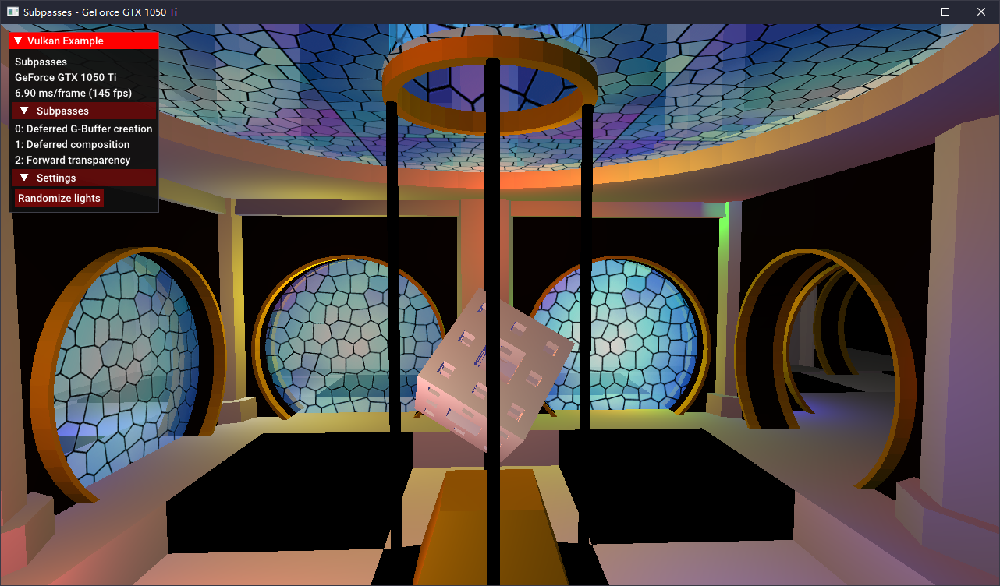
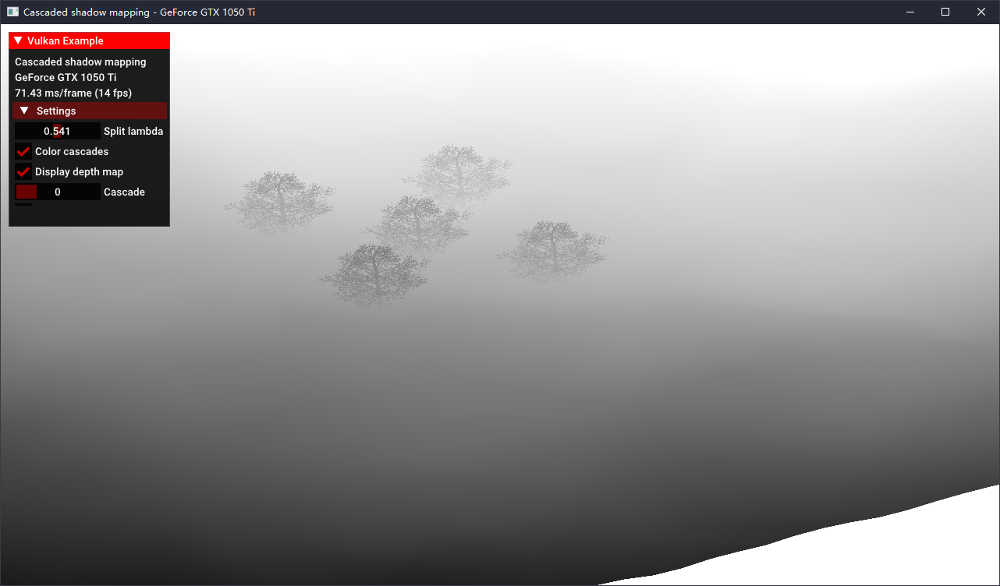
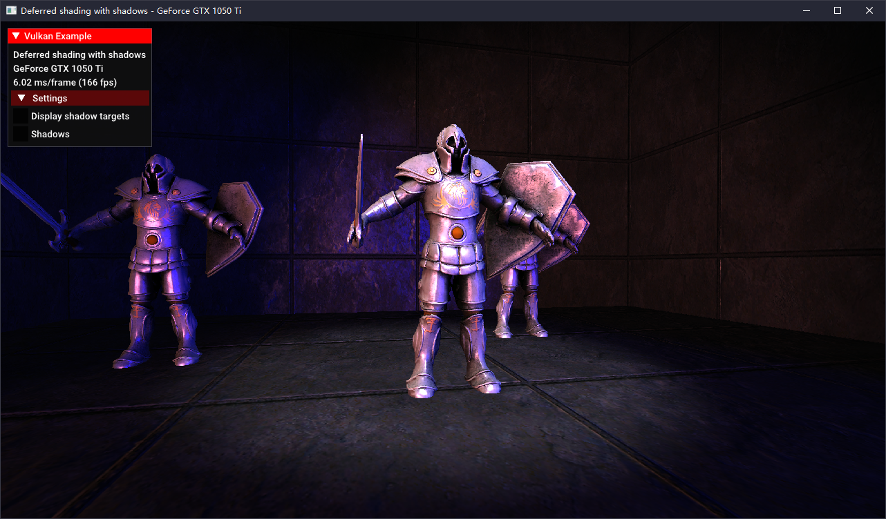
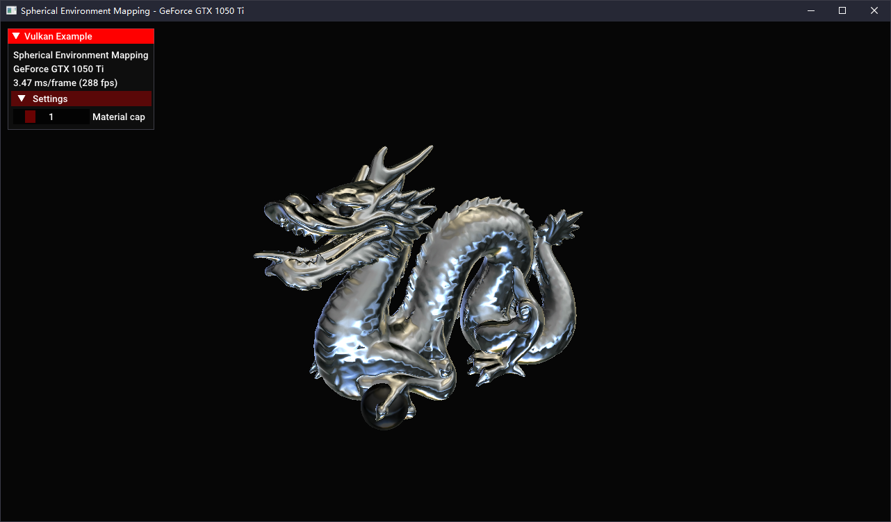

### Basics

#### [01 Triangle](./vs/LearningVulkan/Triangle/)

#### [02 Pipelines](./vs/LearningVulkan/Pipeline/)

#### [03 Descriptor sets]()

#### [04 Dynamic uniform buffers]()

#### [05 Push contants]()

#### [06 Specialization constants]()

#### [Texture mapping]()

#### [08 Cube map textures]()

#### [09 3D Textures]()

#### [10 Input attachments]()

#### [11 Sub passes]()

#### [12 Offscreen rendering]()

#### [13 CPU particle system]()

#### [14 Stencil buffer]()

### Advanced

#### [01 Multi sampling]()

#### [02 High dynamic range]()

#### [03 Shadow mapping]()

#### [04 Cascaded shadow mapping]()

#### [05 Omnidirectional shadow mapping]()

#### [06 Run-time mip-map generation]()

### Performance

#### [01 Multi threaded command buffer generation]()

#### [02 Instancing]()

#### [03 Indirect drawing]()

#### [04 Occlusion queries]()

#### [05 Pipeline statistics]()

### Physically Based Rendering

#### [01 PBR basics]()

#### [02 PBR image based lighting]()

#### [03 Textured PBR with IBL]()

### Deferred

#### [01 Deferred shading basics]()

#### [02 Deffered multi sampling]()

#### [03 Deffered shading shadow mapping]()

#### [04 Screen sapce ambient occlusion]()

### Compute Shader

#### [01 Image processing]()

#### [02 N-body simulation]()

#### [03 Ray tracing]()

#### [04 Cloth simulation]()

#### [05 Cull and LOD]()

### Geometry Shader

#### [01 Normal debugging]()

#### [02 Viewport arrays]()

### Tessellation Shader

#### [01 Displacement mapping]()

#### [02 Dynamic terrain tessellation]()

### User Interface

#### [01 Text rendering]()

#### [02 Distance field fonts]()

#### [03 ImGui overlay]()

### Effects

#### [01 Fullscreen radial blur]()

#### [02 Bloom]()

#### [03 Parallax mapping]()

#### [04 Spherical environment mapping]()

