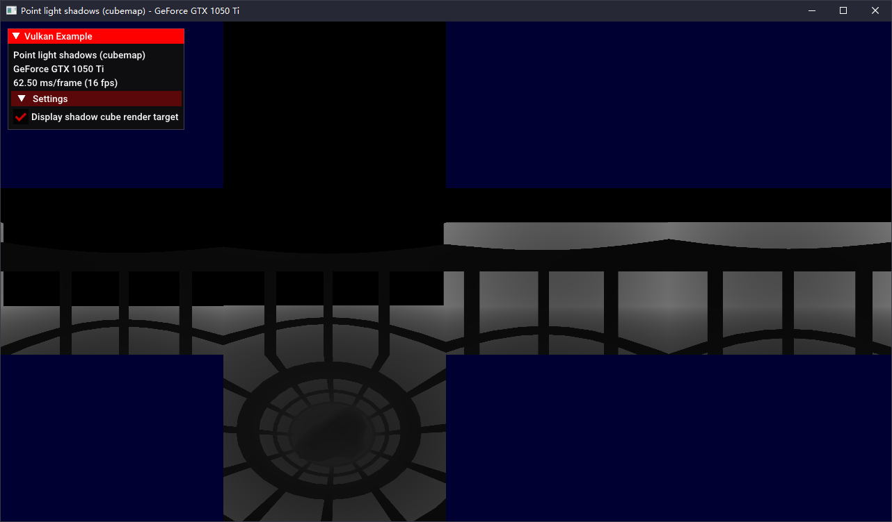

### Basics

#### [01 Triangle](./vs/LearningVulkan/Triangle/)

#### [02 Pipelines](./vs/LearningVulkan/Pipeline/)

#### [03 Descriptor sets](./vs/LearningVulkan/DescriptorSets/)

#### [04 Dynamic uniform buffers](./vs/LearningVulkan/DynamicUniformBuffer/)

#### [05 Push contants](./vs/LearningVulkan/PushConstants/)

#### [06 Specialization constants](./vs/LearningVulkan/SpecializationConstants/)

#### [Texture mapping](./vs/LearningVulkan/Texture/)

#### [08 Cube map textures](./vs/LearningVulkan/TextureCubeMap/)

#### [09 3D Textures](./vs/LearningVulkan/Texture3D/)

#### [10 Input attachments](./vs/LearningVulkan/InputAttachments/)

#### [11 Sub passes](./vs/LearningVulkan/Subpasses/)

#### [12 Offscreen rendering](./vs/LearningVulkan/OffScreen/)

#### [13 CPU particle system](./vs/LearningVulkan/ParticleFire/)

#### [14 Stencil buffer](./vs/LearningVulkan/StencilBuffer/)

### Advanced

#### [01 Multi sampling](./vs/LearningVulkan/MultiSampling/)

#### [02 High dynamic range](./vs/LearningVulkan/HighDynamicRange/)

#### [03 Shadow mapping](./vs/LearningVulkan/ShadowMapping/)

#### [04 Cascaded shadow mapping](./vs/LearningVulkan/ShadowMappingCascade/)

#### [05 Omnidirectional shadow mapping](./vs/LearningVulkan/OmnidirectionalShadowMapping/)

#### [06 Run-time mip-map generation](./vs/LearningVulkan/RuntimeMipMapGeneration/)

### Performance

#### [01 Multi threaded command buffer generation](./vs/LearningVulkan/MultiThreading/)

#### [02 Instancing](./vs/LearningVulkan/Instancing/)

#### [03 Indirect drawing](./vs/LearningVulkan/IndirectDraw/)

#### [04 Occlusion queries](./vs/LearningVulkan/OcclusionQueries/)

#### [05 Pipeline statistics](./vs/LearningVulkan/PipelineStatistics/)

### Physically Based Rendering

#### [01 PBR basics](./vs/LearningVulkan/PBRBasic/)

#### [02 PBR image based lighting](./vs/LearningVulkan/PBRImageBasedLighting/)

#### [03 Textured PBR with IBL](./vs/LearningVulkan/PBRTexture/)

### Deferred

#### [01 Deferred shading basics](./vs/LearningVulkan/DeferredShadingBasics/)

#### [02 Deffered multi sampling](./vs/LearningVulkan/DeferredMultiSampling/)

#### [03 Deffered shading shadow mapping](./vs/LearningVulkan/DeferredShadows/)

#### [04 Screen sapce ambient occlusion](./vs/LearningVulkan/ScreenSpaceAmbientOcclusion/)

### Compute Shader

#### [01 Image processing](./vs/LearningVulkan/ComputeShader/)

#### [02 N-body simulation](./vs/LearningVulkan/ComputeNBody/)

#### [03 Ray tracing](./vs/LearningVulkan/ComputeRayTracing/)

#### [04 Cloth simulation](./vs/LearningVulkan/ComputeCloth/)

#### [05 Cull and LOD](./vs/LearningVulkan/ComputeCullAndLod/)

### Geometry Shader

#### [01 Normal debugging](./vs/LearningVulkan/GeometryShader/)

#### [02 Viewport arrays](./vs/LearningVulkan/ViewportArray/)

### Tessellation Shader

#### [01 Displacement mapping](./vs/LearningVulkan/Tessellation/)

#### [02 Dynamic terrain tessellation](./vs/LearningVulkan/TerrainTessellation/)

### User Interface

#### [01 Text rendering](./vs/LearningVulkan/TextOverlay/)

#### [02 Distance field fonts](./vs/LearningVulkan/DsitanceFieldFonts/)

#### [03 ImGui overlay](./vs/LearningVulkan/ImGuiOverlay/)

### Effects

#### [01 Fullscreen radial blur](./vs/LearningVulkan/RadialBlur/)

#### [02 Bloom](./vs/LearningVulkan/Bloom/)

#### [03 Parallax mapping](./vs/LearningVulkan/ParallaxMapping/)

#### [04 Spherical environment mapping](./vs/LearningVulkan/SphericalEnvironmentMapping/)

