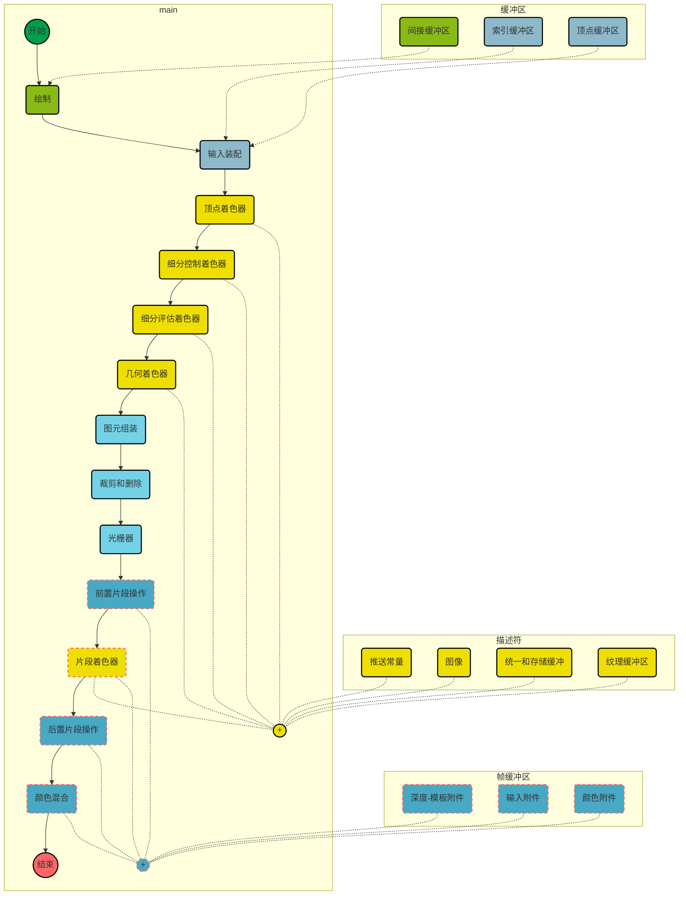

* 绘制：命令进入`Vulkan`图像管线的地方。通常，`Vulkan`设备里一个很小的额处理器或者专用的硬件对命令缓冲区的命令进行解释，并直接和硬件交互来触发工作。
* 输入装配：该阶段读取索引缓存区和顶点缓存区，它们包含了顶点信息，这些顶点组成了你想要绘制的图形。
* 顶点着色器：这是顶点着色器执行的地方。它以属性顶点作为输入，并为下一个阶段准备交换的和处理的顶点数据。
* 细分控制着色器：这个可编程的着色器阶段负责生产细分因子和其他逐片元（patch）数据（被固定功能细分引擎使用）。
* *细分图元生成：这个固有功能阶段使用在细分控制着色器产生的细分因子，来吧图片元分解成许多更小的、更简单的图元，以供细分评估着色器使用。*
* 细分评估着色器：这个着色阶段运行在细分图元生成器中产生的每一个顶点上。它和顶点着色器操作类似——除了输入顶点是生成的以外，而非从内存读取的。
* 几何着色器：这个着色阶段在整个图元上运行。图元可能是点、直线或者三角形，或它们的变种（在它们周围有额外顶点）。这个阶段也有在管线中间改变图元类型能力。
* 图元组装：这个阶段把顶点、细分或几何阶段产生的顶点分组，将它们分组成适合光栅化的图元。它也剔除或裁剪图元，并把图元变换进合适的视口。
* 裁剪和剔除：这个固定功能阶段决定了图元的哪一部分可能成为输出图像的一部分，并抛弃那些不会组成图像的部分，把可见的图元发给光栅器。
* 光栅器：光栅器是`Vulkan`中所有的图形的基本核心。光栅器接受装配好的图元（仍然用一系列顶点表示），并把它们变成单独的片段，片段可能会变成图像的像素。
* 前置片段操作：在着色之前一旦知道了片段的位置，就可以在片段上进行好几个操作。这些前置片段操作包括深度和模板测试（当开启了两个测试时）。
* *片段装配：片段装配阶段接受光栅器的输出，以及任何逐片段数据，将这些信息作为一组，发给片段着色阶段。*
* 片段着色器：这个阶段运行管线里最后着色器。负责计算发送到最后固有功能处理阶段的数据。
* 后置片段操作：在某些情况下，片段着色器会修改本应该在前置片段操作中使用的数据。在这种情况下，这些前置片段操作转移到后置片段操作中执行。
* 颜色混合：颜色操作接受前置片段着色器和后置片段着色器操作的结果，并使用它们更新帧缓冲区。颜色操作包括混合与逻辑操作。