# Learning Vulkan

### 项目结构

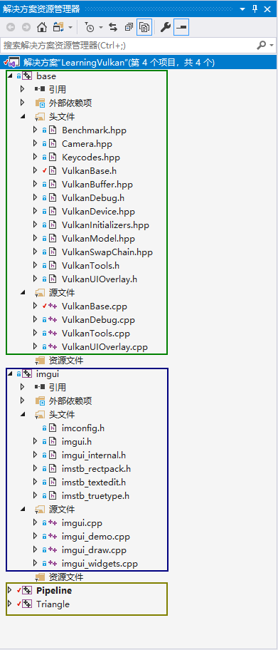

> 自上至下的区域分别是

* Vulkan基本框架
* Windows界面
  * [如何评价imgui](https://www.zhihu.com/question/267602287)
  * [imgui入门笔记](https://www.dazhuanlan.com/2019/12/16/5df6a0950ca0c/)
* Example示例项目

### 项目的属性配置

#### imgui

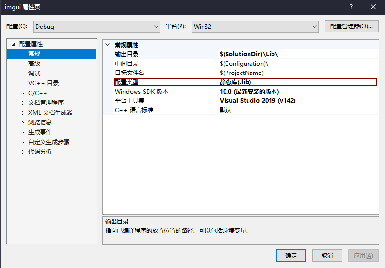

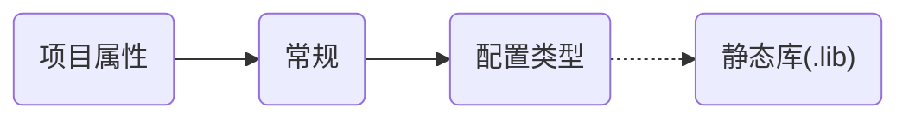

#### base

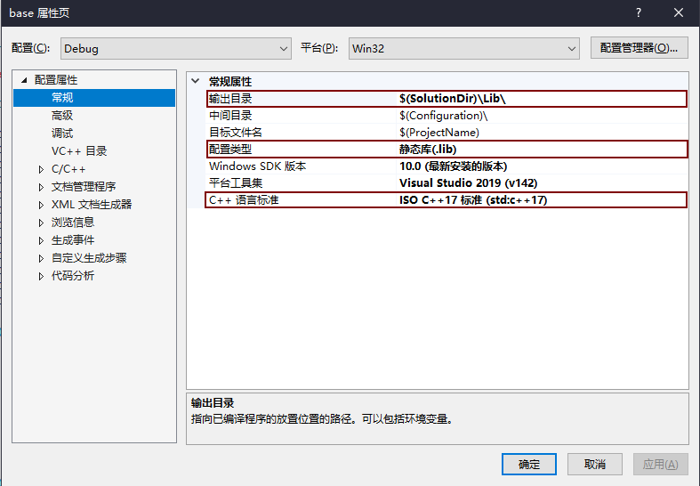

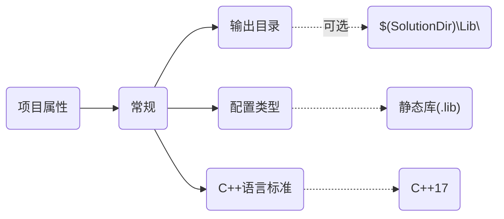

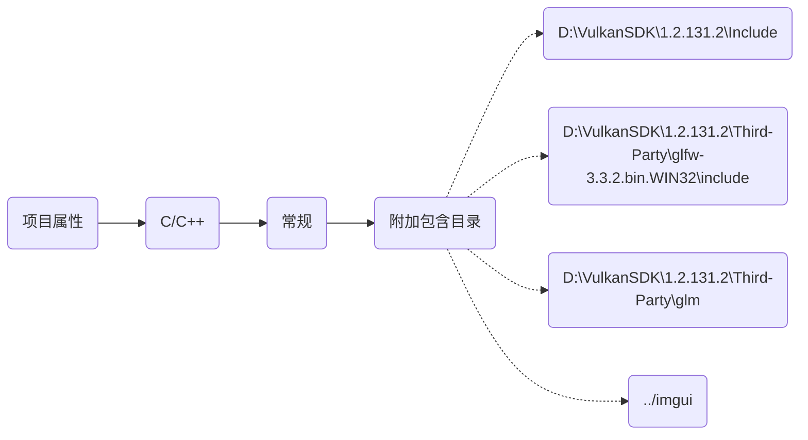

#### Example

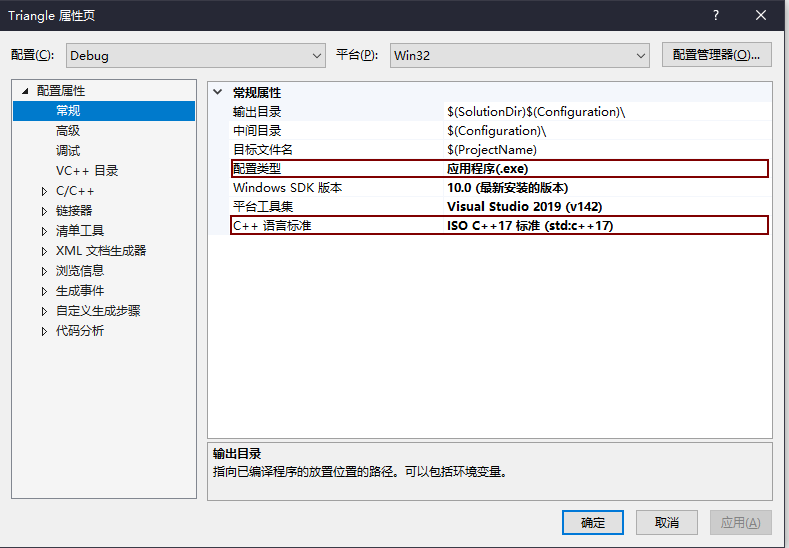

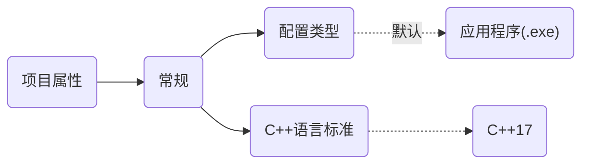

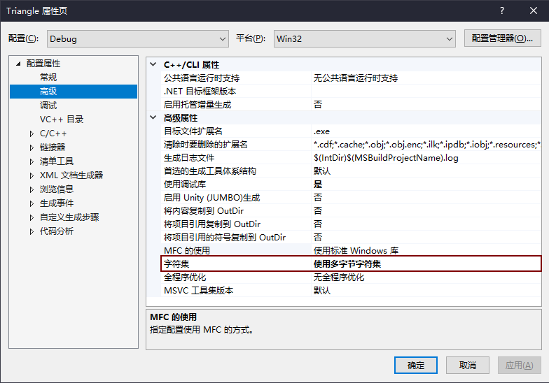

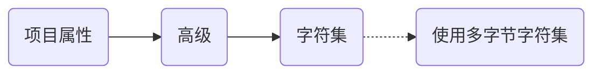

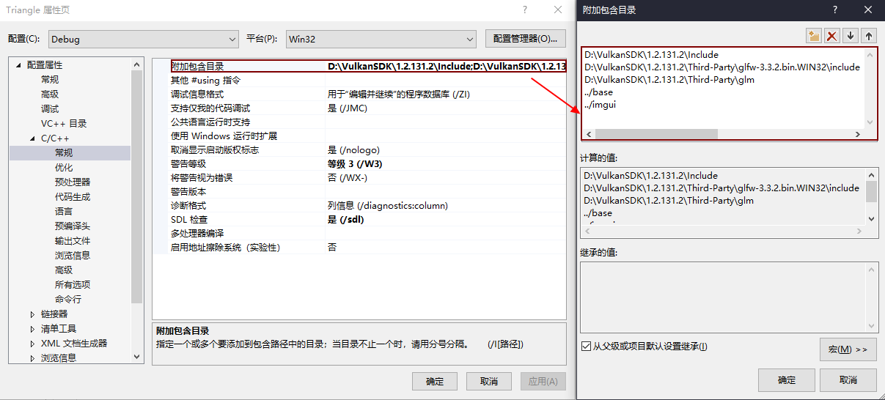

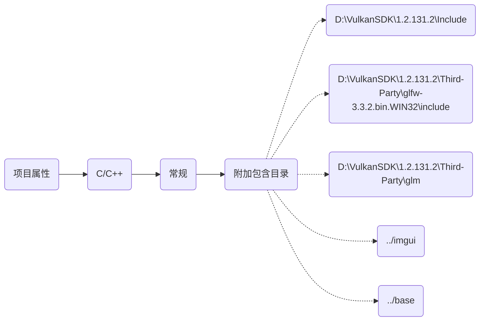

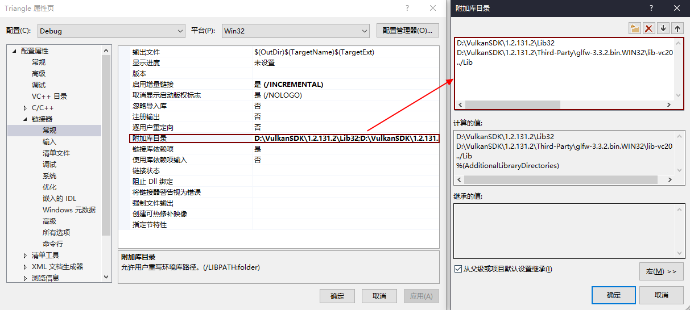

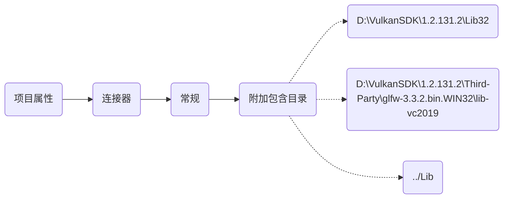

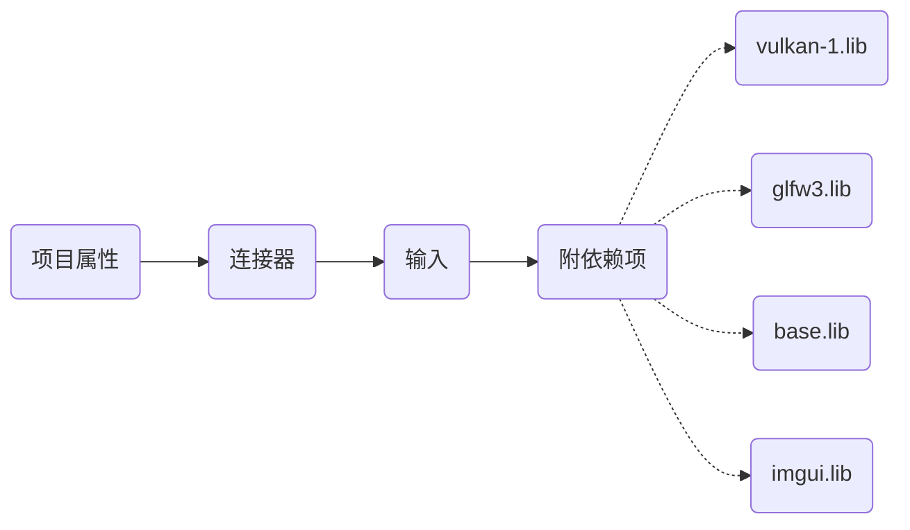

